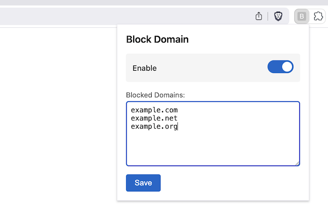
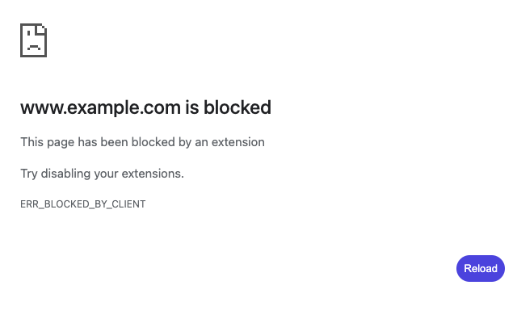

#  Block Domains

Block access to domains to prevent accidentally visiting them.

Works in both Brave and other browsers built on Chromium.

## Installation

### Brave / Chromium

From Chrome Web Store:

1. go to [Chrome Web Store](https://chromewebstore.google.com/detail/block-domains/aeigagnjpfjbclmhddmidiimjagpahmg)
2. Click `Add to ...` button

Manually:

1. [Download latest release from Github](https://github.com/mathio/brave-block-domains/releases/tag/latest)
2. Unpack contents of the zip file to a directory (eg. `brave-extension/`)
3. Go to Brave menu `☰` -> `Extensions` -> `Manage Extensions` and enable `Developer mode` in the top right corner.
4. Click on `Load unpacked` button and point to `brave-extension/` directory.
5. Click the `B` icon in `Extensions` (near the address bar) to open the popup with settings.

## Preview

Toggle blocking and update blocked domains via extension popup.

Blocked domains are not accessible while blocking is enabled.

## Description

- blocks domains entered in extension popup
- can be disabled via a toggle
- there are NO other settings, deal with it

## Privacy and permission justification

Extension requires [declarativeNetRequest and declarativeNetRequestWithHostAccess permissions](https://developer.chrome.com/docs/extensions/reference/api/declarativeNetRequest) to block network requests to specified domains, with all rules processed locally on your device. It uses [host_permissions (all_urls)](https://developer.chrome.com/docs/extensions/develop/concepts/declare-permissions#host-permissions) to apply blocking rules to all websites, but does not access or read content from any websites. The [storage permission](https://developer.chrome.com/docs/extensions/reference/api/storage) is used to save your list of blocked domains and enabled / disabled state locally using Chrome's sync storage (may sync across your devices if you're signed into your browser).

Your blocked domains list stays on your device and is not shared or stored elsewhere. The extension operates entirely offline and makes no external network requests.

## Development

Load the extension manually from `src/` dir to preview changes in your browser.
