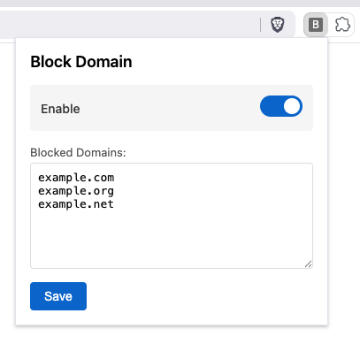

# 🅱️ Block Domains

Block access to domains to prevent accidentally visiting them.

You can toggle blocking and update blocked domains via extension popup.

## Installation

### Brave / Chromium

Manually:

1. [Download latest release from Github](https://github.com/mathio/brave-block-domains/releases/tag/latest)
2. Unpack contents of the zip file to a directory (eg. `brave-extension/`)
3. Go to Brave menu `☰` -> `Extensions` -> `Manage Extensions` and enable `Developer mode` in the top right corner.
4. Click on `Load unpacked` button and point to `brave-extension/` directory.
5. Click the `B` icon in `Extensions` (near the address bar) to open the popup with settings.

## Development

Load the extension manually from `src/` dir to preview changes in your browser.
